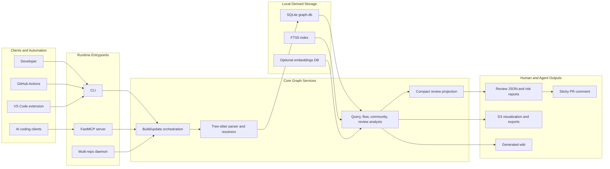
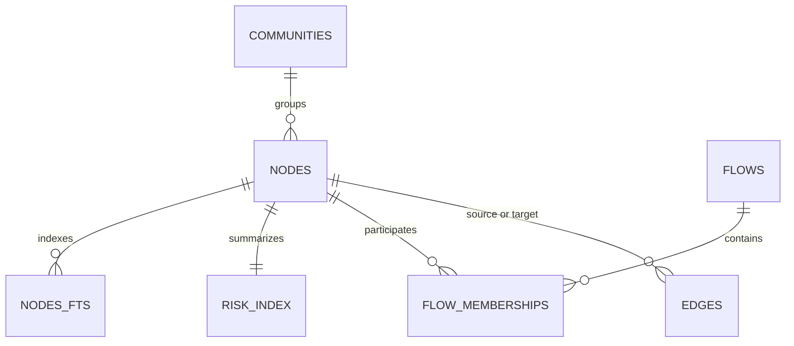
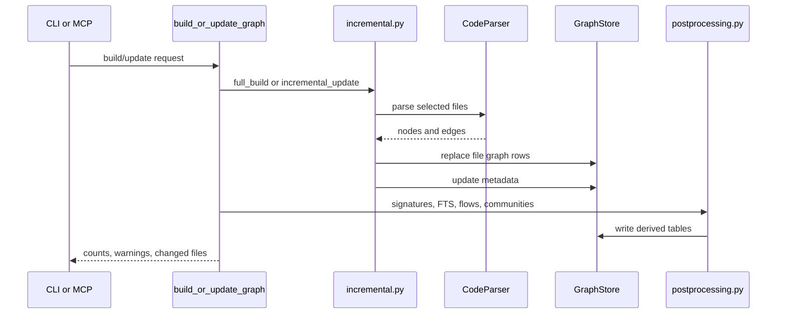
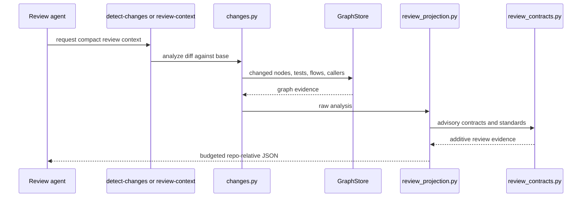

# Code Review Graph Architecture

## Scope

This is the project-level architecture and orientation document for the Zazz-maintained
`code-review-graph` fork. It complements [project.md](../project.md), the upstream user
documentation under [docs/](../../docs/INDEX.md), and the existing short architecture
sketch in [docs/architecture.md](../../docs/architecture.md).

The document describes the current application shape: CLI and MCP runtime surfaces,
local graph storage, parsing and incremental update flow, review-context projection,
post-processing, optional subsystems, and the Zazz fork direction. It does not define a
new feature milestone model.

## Architecture Summary

`code-review-graph` is a local-first code intelligence cache for AI-assisted review. It
parses a repository with Tree-sitter, stores code entities and relationships in a local
SQLite graph, derives review-oriented signals from that graph, and exposes those signals
through a CLI, FastMCP server, GitHub Action, editor integrations, and generated agent
instructions.

The central idea is stable across the product docs: agents should ask the graph targeted
questions instead of repeatedly reading broad file sets. The graph is most valuable for
multi-hop review questions: impact radius, callers and callees, tests for a symbol,
affected execution flows, community boundaries, risk scoring, and compact review
packets. For trivial single-file edits or very small repositories, ordinary grep and
direct file reads can be cheaper.

Current storage is SQLite in `.code-review-graph/graph.db`, treated as a rebuildable
derived cache. The Turso/Rust engine work described in the proposal is a future
direction, not current runtime behavior.

## Runtime Surfaces

| Surface | Primary files | Purpose |
| --- | --- | --- |
| CLI | `code_review_graph/cli.py` | Human and automation entrypoint for install, build, update, review analysis, visualization, wiki, eval, MCP serving, and daemon commands. |
| MCP server | `code_review_graph/main.py`, `code_review_graph/tools/` | FastMCP tool and prompt surface used by Codex, Claude Code, Cursor, Gemini CLI, and other clients. |
| Install and hooks | `code_review_graph/skills.py` | Generates MCP configs, platform instruction files, project skills, and hook scripts for supported clients. |
| GitHub Action | `action.yml`, `scripts/render_pr_comment.py` | Builds or restores the graph in CI, runs risk analysis, and posts a sticky PR comment. |
| Multi-repo daemon | `code_review_graph/daemon.py`, `daemon_cli.py` | Watches many repositories by spawning one `code-review-graph watch` process per repo. |
| VS Code extension | `code-review-graph-vscode/` | Editor-facing explorer, blast-radius, query, visualization, and auto-update surface backed by the Python CLI. |

The MCP server wraps the same implementation functions used by the CLI. Long-running
operations such as build, postprocess, embedding, and wiki generation are offloaded with
`asyncio.to_thread` so the MCP event loop stays responsive. `serve --tools` and
`CRG_TOOLS` can reduce MCP tool-description overhead by exposing only a selected tool set.

## Core Data Model

`GraphStore` owns the SQLite connection, WAL mode, schema setup, migrations, writes, and
queries. The graph stores code as nodes and edges:

- Nodes: `File`, `Class`, `Function`, `Test`, and `Type`.
- Edges: `CALLS`, `IMPORTS_FROM`, `INHERITS`, `IMPLEMENTS`, `CONTAINS`, `TESTED_BY`,
  `DEPENDS_ON`, `REFERENCES`, and specialized data or framework edges.
- Derived tables: flows, flow memberships, communities, FTS5 index, community summaries,
  flow snapshots, risk index, and optional embeddings.

Qualified names use stored file paths plus symbol names, for example
`/repo/src/auth.py::AuthService.login`. Review-facing payloads normalize these absolute
stored paths back to repository-relative paths in `review_projection.py` so agents can
paste, compare, and cache output across machines.

## Build And Update Pipeline

Full build and incremental update share the same parser and store path:

- `collect_all_files()` finds tracked source files, honors `.gitignore` and
  `.code-review-graphignore`, and can include submodules when configured.
- `CodeParser` detects language by extension or shebang, loads built-in or configured
  custom Tree-sitter grammars, and emits `NodeInfo` and `EdgeInfo`.
- `full_build()` parses all collected files, purges stale DB rows, writes nodes and
  edges, stores VCS metadata, and runs language-specific resolvers.
- `incremental_update()` finds changed files from Git or SVN, includes dependent files,
  skips unchanged files by hash, removes deleted files, and reparses only the needed
  set.
- `watch()` batches file events with a debounce and triggers incremental parsing.

## Parser And Resolver Layer

`parser.py` is the broadest source module because it owns cross-language extraction. It
uses Tree-sitter where possible, targeted regex/fallback logic where grammars do not
cover important constructs, and custom `languages.toml` support for repository-local
language onboarding. SQL has dedicated extraction for tables, views, functions,
procedures, and table references. Notebook and single-file component parsing are also
handled in this layer.

Resolver modules enrich the raw graph after parsing:

- `tsconfig_resolver.py` resolves TypeScript path aliases.
- `rescript_resolver.py` adds ReScript-specific resolution.
- `spring_resolver.py` and `temporal_resolver.py` add Java framework edges.
- `jedi_resolver.py` is available for Python call-resolution enrichment.

Parser output should be understood as review-useful structural evidence, not compiler
precision. The FAQ explicitly positions CRG as broader and more persistent than LSP,
but less exact for a single symbol in one language.

## Post-Processing And Analysis

Post-processing is deliberately separate from parsing so builds can choose `full`,
`minimal`, or `none`:

- Signatures: human-readable symbol summaries used by search and output.
- FTS5: full-text search over names, qualified names, file paths, and signatures.
- Flows: entry-point call chains with criticality scoring.
- Communities: Leiden clustering when `igraph` is available, with file-based fallback.
- Summaries: compact community, flow, and risk rows for token-efficient queries.

Analysis modules sit on top of this derived graph:

- `changes.py` maps diffs to changed functions/classes/tests, computes risk, finds
  affected flows, and constructs test gaps.
- `review_projection.py` builds compact, deterministic, budgeted review packets.
- `context_savings.py` estimates token savings and labels the measurement scope.
- `review_contracts.py` adds configurable advisory review signals such as synthetic
  contract edges, service policy gaps, SQL/HTTP contract mismatches, and ambiguous-text
  reconciliation evidence.
- `review_standards.py` projects matching Zazz standards into review context without
  inlining full standards files.

## Query And Review Flow

The review flow starts from a diff or explicit changed-file list, refreshes the graph
when requested, maps changed lines to graph nodes, scores risk, and emits a compact
payload. The same underlying pieces are exposed through CLI commands and MCP tools.

Important review commands:

- `detect-changes --brief` is read-only against the existing graph and prints a risk
  summary plus the change-analysis savings panel.
- `update --brief` reparses changed files first, then prints the same panel.
- `detect-changes --for-review --max-tokens N` emits compact JSON for a review agent.
- `review-context --base <ref> --max-tokens N` refreshes the graph, then emits compact
  review JSON.
- `--scope <glob>` creates section-oriented packets for sub-agents.

## Optional Subsystems

| Subsystem | Files | Notes |
| --- | --- | --- |
| Embeddings | `embeddings.py`, `search.py` | Optional local, OpenAI-compatible, Google, and MiniMax providers. Core graph workflows do not require embeddings. |
| Hybrid search | `search.py` | Combines FTS, keyword search, identifier extraction, and optional vectors. |
| Visualization | `visualization.py`, `exports.py` | Generates D3 HTML plus GraphML, Cypher, Obsidian, and SVG exports. |
| Wiki | `wiki.py`, `tools/docs.py` | Generates community-oriented markdown wiki pages, optionally with local LLM summaries. |
| Refactoring | `refactor.py`, `tools/refactor_tools.py` | Preview and apply rename, dead-code, and community-driven suggestions. |
| Evaluation | `eval/`, `token_benchmark.py` | Reproducible benchmarks for token efficiency, impact accuracy, agent baseline, and multi-hop retrieval. |
| Memory | `memory.py` | Persists Q&A results as markdown for later re-ingestion. |

## Cross-Cutting Concerns

**Local-first privacy.** Core build, search, review, CLI, MCP, and CI analysis use local
files and local SQLite. No telemetry exists. Cloud embeddings are opt-in and limited to
the configured provider.

**Derived-cache safety.** The graph DB is rebuildable and normally gitignored. Schema
migrations preserve compatibility across versions, but stale or corrupt graph state can
be fixed by rebuilding.

**Concurrency.** SQLite uses WAL and busy timeout. Parsing can run in process or thread
executors while DB writes remain serialized. MCP build-like tools offload blocking work
to avoid event-loop stalls.

**Path portability.** Storage keeps absolute paths for lookup compatibility. Review
outputs normalize to repo-relative paths at projection boundaries.

**Budget honesty.** Token savings are estimates based on `chars / 4`, and recent output
labels the measurement as change-analysis context, not whole review-session cost.

**Configuration.** Important controls live in environment variables, `.code-review-graphignore`,
`.code-review-graph/languages.toml`, and `[tool.code-review-graph.*]` sections in
`pyproject.toml`.

**Zazz review boundary.** In this fork, CRG output is advisory. Zazz `pr-review` still
uses standards, specs, source inspection, and human review as authority.

## Zazz Fork Direction

The fork exists to improve CRG for Zazz-style PR review. Current implemented direction
centers on compact, deterministic, scoped review packets and scope-honest token savings.
The latest local work also adds advisory contract signals and standards applicability
projection to make missed review patterns reproducible.

The proposal in
[code-review-graph-token-efficiency-and-turso-engine.md](../proposals/code-review-graph-token-efficiency-and-turso-engine.md)
sets a two-phase direction:

- Phase 1: improve review-output shape, in-product measurement, and new-file review
  signal.
- Phase 2: evaluate a Turso/Rust engine behind the `GraphStore` boundary, with FTS
  parity as the hardest known blocker.

As of this document, SQLite remains the actual engine. The architecture should continue
to protect `GraphStore` as the storage boundary so future engine work can be isolated.

## Orientation By File

| Area | Start here | Then read |
| --- | --- | --- |
| CLI behavior | `code_review_graph/cli.py` | `docs/COMMANDS.md`, `docs/USAGE.md` |
| MCP tools | `code_review_graph/main.py` | `code_review_graph/tools/*.py` |
| Storage | `code_review_graph/graph.py` | `code_review_graph/migrations.py`, `docs/schema.md` |
| Parsing | `code_review_graph/parser.py` | `custom_languages.py`, resolver modules |
| Build/update | `code_review_graph/incremental.py` | `tools/build.py`, `postprocessing.py` |
| Review analysis | `code_review_graph/changes.py` | `review_projection.py`, `context_savings.py` |
| Zazz review extensions | `review_contracts.py` | `review_standards.py`, `.zazz/standards/index.yaml` |
| Search | `search.py` | `embeddings.py` |
| Flows and communities | `flows.py`, `communities.py` | `tools/flows_tools.py`, `tools/community_tools.py` |
| Install integration | `skills.py` | `README.md`, `docs/TROUBLESHOOTING.md` |
| CI review | `action.yml` | `scripts/render_pr_comment.py`, `docs/GITHUB_ACTION.md` |
| Benchmarks | `code_review_graph/eval/` | `docs/REPRODUCING.md` |

## Tracked Documentation Map

Use these tracked worktree docs as the next layer of orientation:

| Need | Document |
| --- | --- |
| Product overview, install path, benchmark positioning, feature table | [README.md](../../README.md) |
| Editor integration shape | [code-review-graph-vscode/README.md](../../code-review-graph-vscode/README.md) |
| User workflow and review commands | [docs/USAGE.md](../../docs/USAGE.md) |
| Complete CLI, MCP tool, and prompt reference | [docs/COMMANDS.md](../../docs/COMMANDS.md) |
| Existing upstream architecture sketch | [docs/architecture.md](../../docs/architecture.md) |
| Node, edge, and SQLite schema details | [docs/schema.md](../../docs/schema.md) |
| Custom language extension model | [docs/CUSTOM_LANGUAGES.md](../../docs/CUSTOM_LANGUAGES.md) |
| CI review action behavior | [docs/GITHUB_ACTION.md](../../docs/GITHUB_ACTION.md) |
| Benchmark methodology and canonical numbers | [docs/REPRODUCING.md](../../docs/REPRODUCING.md) |
| Comparison with LSP, RAG, grep, and adjacent tools | [docs/FAQ.md](../../docs/FAQ.md) |
| Current release feature history and privacy notes | [docs/FEATURES.md](../../docs/FEATURES.md) |
| Planned and shipped roadmap items | [docs/ROADMAP.md](../../docs/ROADMAP.md) |
| Zazz fork purpose and current direction | [project.md](../project.md) |
| Zazz-specific CRG review policy | [code-review-graph.md](../code-review-graph.md) |
| Human-in-the-loop review model | [human-in-loop-pr-review-strategy.md](../human-in-loop-pr-review-strategy.md) |
| Zazz methodology overview | [zazz-methodology.md](../zazz-methodology.md) |
| Current token-efficiency and Turso proposal | [code-review-graph-token-efficiency-and-turso-engine.md](../proposals/code-review-graph-token-efficiency-and-turso-engine.md) |
| Active review-output specification | [mw-improve-metrics-analysis-zazz.md](../specifications/mw-improve-metrics-analysis-zazz.md) |

## Open Architecture Questions

- Should the long-term parser architecture split `parser.py` by language family, or is
  the single dispatcher still acceptable despite its size?
- Should review-specific advisory extraction remain a projection-time helper, or should
  some synthetic contract edges become persisted graph edges after the rule shape settles?
- How much of Zazz standards applicability should CRG compute itself versus leaving to
  methodology skills?
- If Turso work proceeds, should FTS compatibility be handled inside `GraphStore`, in a
  search adapter, or upstream in Turso?
- Should whole-review-session token measurement live in CRG, in a Zazz review harness,
  or in both with different scopes?

## References Reviewed

- [README.md](../../README.md) and [code-review-graph-vscode/README.md](../../code-review-graph-vscode/README.md)
- All primary upstream docs under [docs/](../../docs/INDEX.md), including usage,
  commands, features, FAQ, architecture, schema, GitHub Action, custom languages,
  troubleshooting, roadmap, legal/privacy, and benchmark reproduction.
- Zazz project and methodology docs under `.zazz/`, especially
  [project.md](../project.md), [code-review-graph.md](../code-review-graph.md),
  [human-in-loop-pr-review-strategy.md](../human-in-loop-pr-review-strategy.md),
  [zazz-methodology.md](../zazz-methodology.md), and the methodology section docs.
- The active proposal and specification:
  [code-review-graph-token-efficiency-and-turso-engine.md](../proposals/code-review-graph-token-efficiency-and-turso-engine.md)
  and [mw-improve-metrics-analysis-zazz.md](../specifications/mw-improve-metrics-analysis-zazz.md).
- Key implementation modules under `code_review_graph/`, `scripts/`, `action.yml`,
  and the VS Code extension README.
